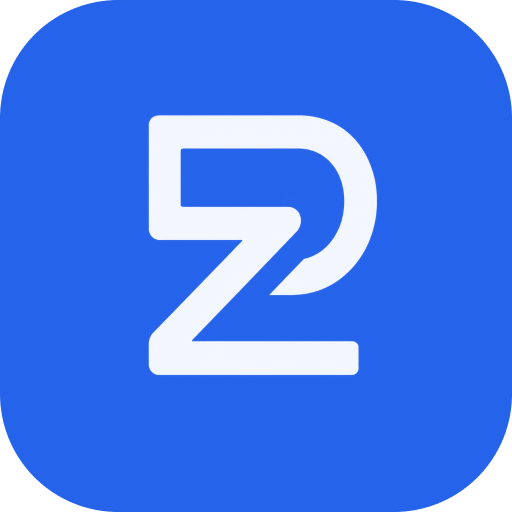

<p align="center">
  
</p>

<h1 align="center">PostZen CLI</h1>

<p align="center">
  <a href="https://www.npmjs.com/package/@postzen/cli"></a>
  <a href="LICENSE"></a>
</p>

<p align="center"><strong>One CLI to post everywhere. 8 platforms, zero headaches.</strong></p>

The official command-line interface for the [PostZen API](https://docs.postzen.dev) — schedule posts, manage profiles, connect social accounts, and upload media across X/Twitter, Instagram, TikTok, LinkedIn, Facebook, YouTube, Threads, and Pinterest, straight from your terminal.

## Install

```bash
npm install -g @postzen/cli
```

Zero runtime dependencies; requires Node 20+.

## Quick Start

1. Save your API key ([create one here](https://app.postzen.dev/api-keys)):

```bash
postzen auth:set --key pzn_live_...
```

2. List your connected accounts:

```bash
postzen accounts:list
```

3. Schedule a post:

```bash
postzen posts:create \
  --content "We just shipped 🚀" \
  --scheduledFor "2026-08-01T09:00:00Z" \
  --platforms '[{"platform":"x","accountId":"acc_123"}]'
```

## Authentication

### API key

Create an API key on the [API Keys page](https://app.postzen.dev/api-keys) and save it:

```bash
postzen auth:set --key pzn_live_...
```

The key is validated against the API, then stored in `~/.postzen/config.json` with `0600` permissions. In CI or scripts, skip the config file and set `POSTZEN_API_KEY` instead.

### Verify

```bash
postzen auth:check    # verifies the resolved key against the API
postzen auth:status   # shows the masked key and where it came from
```

## Commands

Commands are `group:action` tokens. Path parameters are positional; everything else is a `--flag` using the exact field names from the API. Run `postzen <command> --help` for the flags, types, and enums of any command.

| Command | Description |
| --- | --- |
| **Auth** | |
| `auth:set` | Validate an API key and save it locally |
| `auth:check` | Verify the resolved API key against the API |
| `auth:status` | Show the masked key in use and where it came from |
| **Profiles** | |
| `profiles:list` | List profiles |
| `profiles:create` | Create a profile |
| `profiles:get <profileId>` | Get a profile |
| `profiles:update <profileId>` | Update a profile |
| `profiles:delete <profileId>` | Delete a profile |
| **Accounts** | |
| `accounts:list` | List connected social accounts |
| `accounts:disconnect <accountId>` | Disconnect an account |
| **Connect** | |
| `connect:create-url <platform>` | Create an OAuth connect URL |
| `connect:complete <platform>` | Complete an OAuth connection |
| **Media** | |
| `media:upload <file>` | Upload a media file and get back its public URL |
| **Posts** | |
| `posts:create` | Create a draft, scheduled, or immediate post |

All commands print a single compact line of JSON to stdout (add `--pretty` to indent). API errors print `{"error":{...}}` to stderr and exit `1`; usage errors exit `2`.

## Configuration

Your API key is stored in `~/.postzen/config.json`. Environment variables always take precedence:

| Variable | Description |
| --- | --- |
| `POSTZEN_API_KEY` | API key; overrides the saved key |
| `POSTZEN_API_URL` | Base URL override (defaults to `https://api.postzen.dev`) |

## AI Agent Integration

The CLI is built for agents: every command is a single predictable invocation that returns machine-readable JSON and a meaningful exit code, so agents can compose it with `jq`, cron, or any tool-calling loop. This repo (and the npm package) includes a [SKILL.md](SKILL.md) file with workflows, recipes, and error-handling guidance for AI agent discovery. For chat-based agents, PostZen also ships a hosted [MCP server](https://docs.postzen.dev/mcp) that exposes the same API as native tools for Claude, Cursor, and other MCP clients.

## Supported Platforms

X (Twitter), Instagram, TikTok, LinkedIn, Facebook, YouTube, Threads, Pinterest

## License

[MIT](LICENSE)
