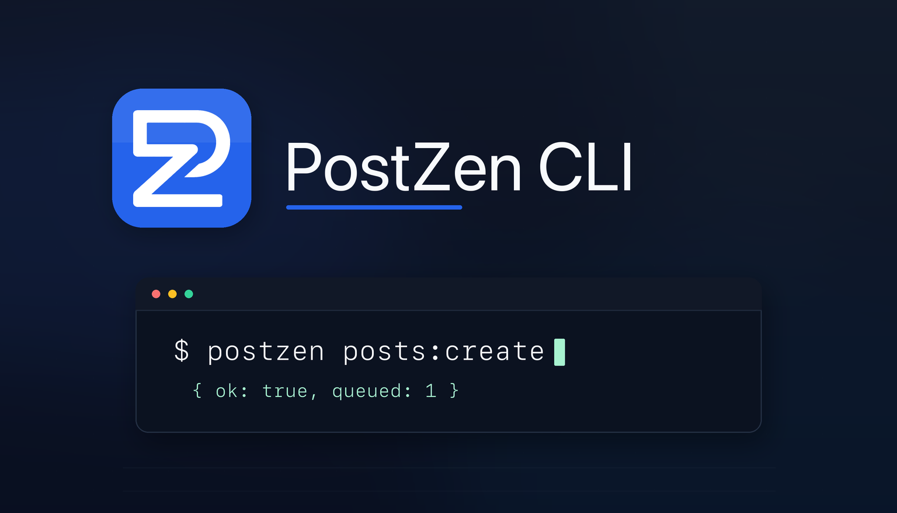

<p align="center">
  
</p>

<h1 align="center">PostZen CLI</h1>

<p align="center">
  Drive the <a href="https://postzen.dev">PostZen</a> social publishing API from your terminal.<br />
  JSON in, JSON out — built for shell pipelines, cron jobs, CI, and AI agents.
</p>

<p align="center">
  <a href="https://www.npmjs.com/package/@postzen/cli"></a>
  <a href="https://www.npmjs.com/package/@postzen/cli"></a>
  <a href="LICENSE"></a>
</p>

---

Every command maps directly onto an API endpoint and prints a single line of JSON to stdout, with meaningful exit codes.

This repo is auto-generated: when the [PostZen OpenAPI spec](https://docs.postzen.dev/api-reference) changes, CI regenerates the commands from `openapi.json` and publishes a new release — so the CLI always matches the current API surface. The same pipeline keeps the [Node](https://github.com/postzen-dev/postzen-node) and [Python](https://github.com/postzen-dev/postzen-python) SDKs and the [MCP server](https://docs.postzen.dev/mcp) in sync.

## Install

```bash
npm install -g @postzen/cli
```

Zero runtime dependencies; requires Node 20+.

## Authenticate

Create an API key on the [API Keys page](https://app.postzen.dev/api-keys), then:

```bash
postzen auth:set --key pzn_live_...   # validates, then saves to ~/.postzen/config.json (0600)
postzen auth:check                    # verify the resolved key
postzen auth:status                   # show the masked key and where it came from
```

`POSTZEN_API_KEY` overrides the saved key (useful in CI); `POSTZEN_API_URL` overrides the base URL.

## Usage

Commands are `group:action` tokens. Path parameters are positional; everything else is a `--flag` using the exact field names from the API.

```bash
# Schedule a post
postzen posts:create \
  --content "We just shipped 🚀" \
  --scheduledFor "2026-08-01T09:00:00Z" \
  --platforms '[{"platform":"x","accountId":"acc_123"}]' \
  --tags launch,product

# Pipe into jq
postzen profiles:list | jq '.profiles[].name'

# Explore
postzen help                    # all commands
postzen posts                   # commands in one group
postzen posts:create --help     # flags, types, and enums for one command
```

### Output and exit codes

| Result | Where | Exit code |
| --- | --- | --- |
| Success | compact JSON on stdout (`--pretty` to indent) | `0` |
| API error (non-2xx) | `{"error":{"status":...}}` on stderr | `1` |
| Usage error (bad flag, missing arg) | human-readable message on stderr | `2` |

Scalar array flags accept comma-separated values or repeated flags; structured values are passed as JSON strings.

## PostZen developer tools

| Tool | Where |
| --- | --- |
| API docs | [docs.postzen.dev](https://docs.postzen.dev) · [API reference](https://docs.postzen.dev/api-reference) |
| Node SDK | [postzen-dev/postzen-node](https://github.com/postzen-dev/postzen-node) · `npm install @postzen/node` |
| Python SDK | [postzen-dev/postzen-python](https://github.com/postzen-dev/postzen-python) · `pip install postzen-sdk` |
| MCP server | [docs.postzen.dev/mcp](https://docs.postzen.dev/mcp) — for Claude, Cursor, and other MCP clients |
| CLI docs | [docs.postzen.dev/cli](https://docs.postzen.dev/cli) |

## Development

```bash
npm ci
npm run generate   # regenerate src/generated/commands.ts from openapi.json
npm run build      # generate + tsc -> dist/
npm test           # smoke tests against a local mock server
```

`openapi.json` and `src/generated/commands.ts` are synced automatically from the postzen monorepo — don't edit them by hand here.

## License

[MIT](LICENSE)
